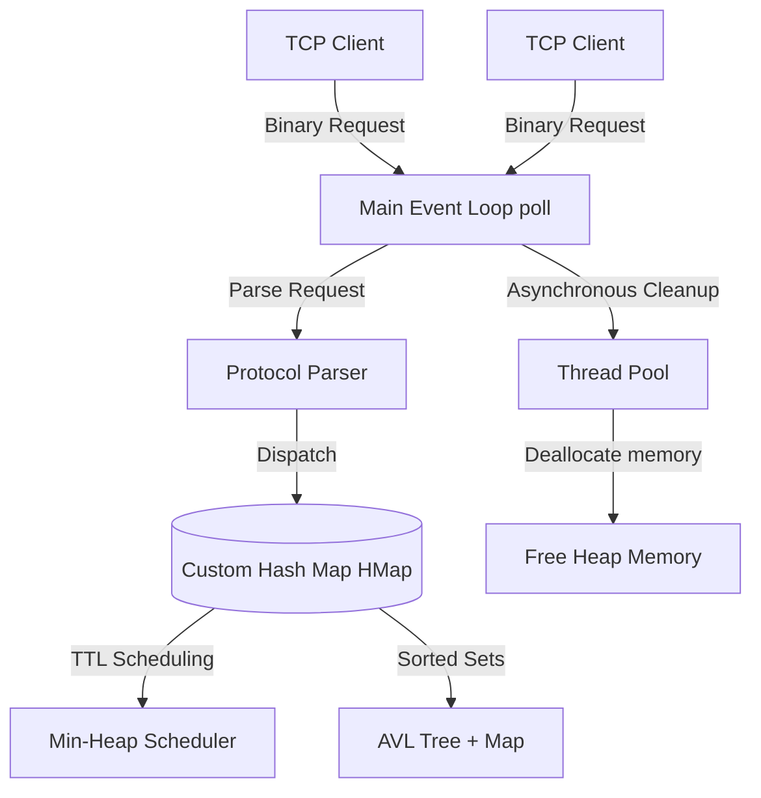

# High-Performance Custom Redis Database in C++

A lightweight, custom-built Redis clone built from scratch in C++. This project demonstrates low-level systems programming, custom memory layouts, high-performance algorithms, and network optimization techniques.

## 🚀 Key Features
- **Non-Blocking I/O Multiplexing:** Utilizes a single-threaded event loop driven by the `poll()` system call to handle thousands of concurrent client connections efficiently.
- **Custom Hash Map (`HMap`):** Features **progressive/incremental rehashing** to avoid latency spikes during table resizing by spreading the reallocation work across subsequent lookups and updates.
- **Sorted Sets (`ZSET`):** Implements Redis-style Sorted Sets utilizing a custom self-balancing **AVL Tree** (for O(log N) range queries) coupled with a hash map (for O(1) membership and score queries).
- **Active & Passive Key Expiration (TTL):** Active eviction of expired keys managed via a **Min-Heap** data structure, alongside lazy (passive) eviction on key access.
- **Doubly-Linked List Connection Tracker:** Automatically tracks idle connections to prune inactive sockets and free kernel descriptors.
- **Worker Thread Pool:** Offloads expensive cleanup and destructor operations (e.g., deleting large sorted sets) to a background thread pool to ensure the main event loop never stalls.
- **Binary Wire Protocol:** Implements a custom, framing-safe binary protocol supporting request pipelining.

---

## 🛠️ Architecture Overview



---

## 💻 Supported Commands

| Command | Arguments | Description |
| :--- | :--- | :--- |
| `GET` | `key` | Retrieve the string value associated with a key. |
| `SET` | `key value` | Store a string value associated with a key. |
| `DEL` | `key` | Remove a key-value entry. |
| `KEYS` | | Retrieve all active keys. |
| `PEXPIRE` | `key ttl_ms` | Set a time-to-live (TTL) on a key in milliseconds. |
| `PTTL` | `key` | Retrieve the remaining TTL of a key in milliseconds. |
| `ZADD` | `zset score name` | Add a member with a score to a Sorted Set. |
| `ZREM` | `zset name` | Remove a member from a Sorted Set. |
| `ZSCORE` | `zset name` | Retrieve the score of a member in a Sorted Set. |
| `ZQUERY` | `zset score name offset limit` | Range query Sorted Set members starting from `(score, name)`. |

---

## 🔨 How to Build & Run

### Prerequisites
- GCC / G++ compiler supporting C++17.
- `make` utility.
- Linux, macOS, or Windows WSL environment (requires POSIX socket headers).

### Building
Compile the project using the optimized `Makefile`:
```bash
make
```

### Running the Server
Start the server (by default, listens on wildcard address `0.0.0.0` at port `1234`):
```bash
./redis_server
```

---

## 🐳 Docker Deployment
To build and run the server inside an isolated container:

1. **Build the Docker Image:**
   ```bash
   docker build -t custom-redis .
   ```

2. **Run the Container:**
   ```bash
   docker run -d -p 1234:1234 --name my-redis-server custom-redis
   ```

3. **Verify running:**
   ```bash
   docker ps
   ```

---

## 📂 Codebase Reorganization
- **`src/main.cpp`:** Server entry point and event loop dispatcher.
- **`src/hashtable.cpp` / `src/hashtable.h`:** Intrusive custom hash table with background rehashing.
- **`src/avl.cpp` / `src/avl.h`:** Height-balanced AVL tree implementation with node counts.
- **`src/zset.cpp` / `src/zset.h`:** Sorted Set abstraction layer.
- **`src/heap.cpp` / `src/heap.h`:** Min-heap implementation for key expiration timing.
- **`src/thread_pool.cpp` / `src/thread_pool.h`:** Background worker thread pool.
- **`src/list.h`:** Circular doubly-linked list for managing idle connection timeouts.
